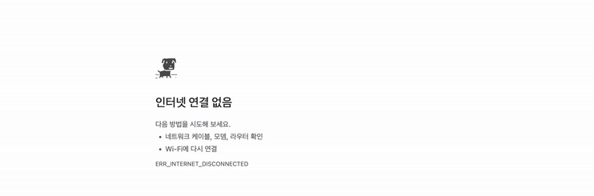

## 듀…가다디런!

## 가나디 런을 사용하고 싶은 사람들을 위한 요약

1. 코드를 다운
2. 압축 해제
3. chrome://extensions/ 에 접속
4. “압축해제된 프로그램 로드” 버튼을 통해 코드 등록
5. 와이파이 연결 끊고 테스트 해 보기 (Naver 입력해 보기 추천)

끝!

## 커스텀한 아트를 사용 하고 싶은 사람들을 위한 요약

1. 코드를 다운
2. 압축 해제
3. assets/themes/default 폴더에 있는 theme-config.json 파일을 읽어 조건에 맞게 아트 제작(assets/themes/default/sprites/2x 에 위치한 orig.png 파일을 다운 해서 그 위에 수정하는게 가장 편함)
4. 나머지는 doucs 폴더에 있는 ASSET_REQUIREMENTS.md 파일을 읽고 기재된거 읽어가며 따라 하면 된다.

즐기세용

## 📜 License

이 프로젝트는 두 가지 라이선스가 혼합되어 있습니다.

### [CC BY-NC 4.0](https://creativecommons.org/licenses/by-nc/4.0/) (개인 구현 부분)
제가 직접 구현한 아래 구성 요소들은 **저작자 표시(Attribution)** 및 **비영리(NonCommercial)** 조건 하에 자유롭게 공유 및 수정이 가능합니다.
*   크롬 익스텐션 가로채기 로직 (`background.js`, `manifest.json`)
*   동적 테마 로딩 시스템 (`asset-loader.js`)
*   모든 커스텀 아트 및 사운드 자산 (`assets/`)

### [BSD 3-Clause](https://opensource.org/licenses/BSD-3-Clause) (원본 엔진 부분)
*   게임의 핵심 물리 엔진 및 기본 스타일 (`index.js`, `index.css`)은 원본 오픈 소스의 라이선스를 따릅니다.

### Art
*   듀... 가나디 ip는 @bdemgmr에게 있습니다